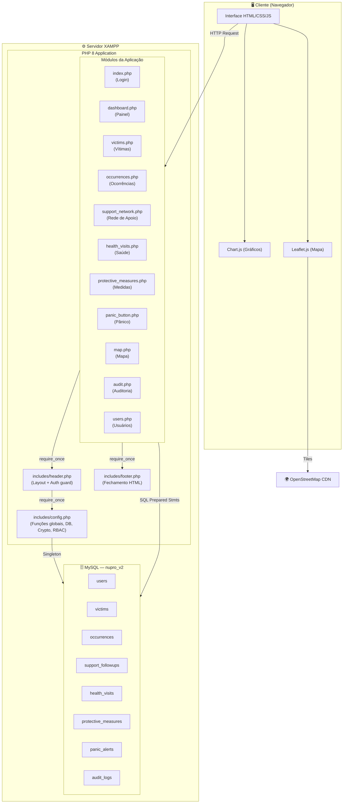
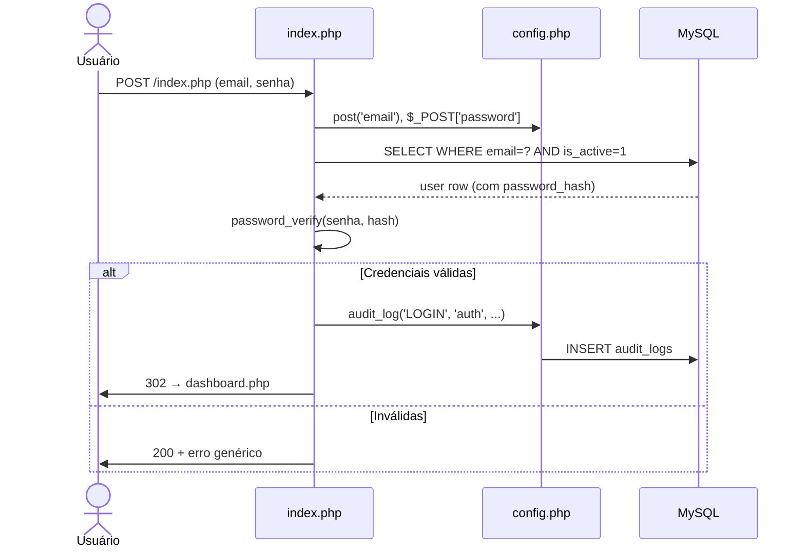
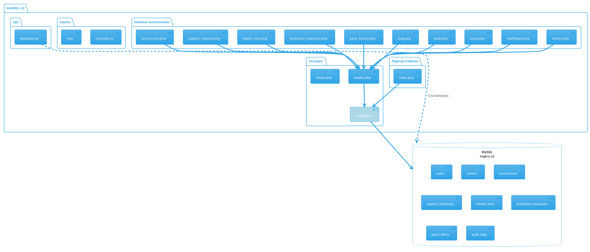
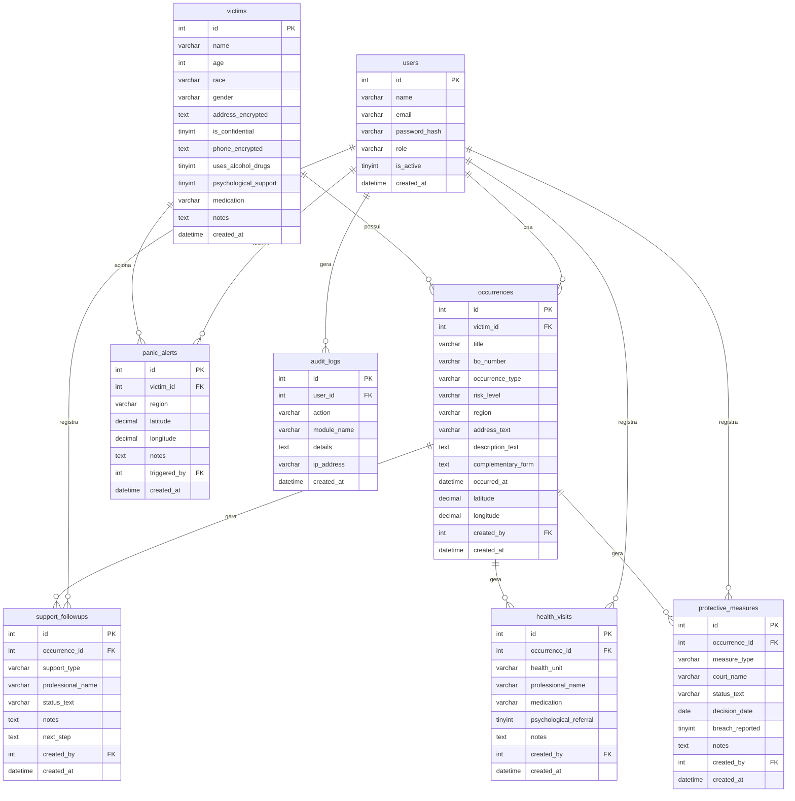
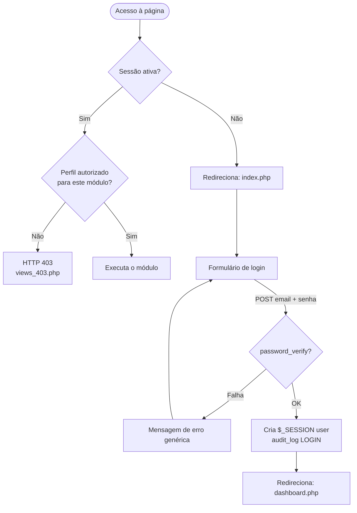

# 🛡️ NUPRO+ V2

> **Sistema de Proteção contra Violência à Mulher**  
> Projeto Acadêmico — Engenharia de Software | FATEC  
> PHP 8+ · MySQL · XAMPP · Lei Maria da Penha (Nº 11.340/2006)

---

## 📋 Índice

1. [Visão Geral](#-visão-geral)
2. [Funcionalidades](#-funcionalidades)
3. [Tecnologias](#-tecnologias)
4. [Requisitos](#-requisitos)
5. [Instalação e Execução](#-instalação-e-execução)
6. [Arquitetura do Sistema](#-arquitetura-do-sistema)
7. [Modelo de Banco de Dados](#-modelo-de-banco-de-dados)
8. [Fluxo de Autenticação](#-fluxo-de-autenticação)
9. [Controle de Acesso por Perfil](#-controle-de-acesso-por-perfil-rbac)
10. [Estrutura de Arquivos](#-estrutura-de-arquivos)
11. [Segurança](#-segurança)
12. [Logins de Demonstração](#-logins-de-demonstração)
13. [Próximos Passos](#-próximos-passos)

---

## 🎯 Visão Geral

O **NUPRO+** é um sistema de gestão local desenvolvido para apoiar Núcleos de Proteção à Mulher, integrando em uma única plataforma:

- Registro e acompanhamento de ocorrências de violência doméstica
- Gestão de vítimas com proteção de dados sensíveis (criptografia AES-256)
- Coordenação da rede de apoio multidisciplinar (saúde, psicologia, jurídico, segurança)
- Controle de medidas protetivas e alertas de emergência
- Dashboard analítico com gráficos e mapa de calor por região
- Trilha completa de auditoria para conformidade com LGPD

---

## ✅ Funcionalidades

| Módulo | Descrição |
|---|---|
| **Dashboard** | KPIs, gráficos de risco/região/horário, alertas de pânico recentes |
| **Vítimas** | Cadastro com endereço e telefone criptografados, flag de sigilo |
| **Ocorrências / B.O.** | Registro com nível de risco (A/B/C), geolocalização, formulário complementar |
| **Rede de Apoio** | Acompanhamento multidisciplinar por ocorrência |
| **Posto de Saúde** | Registro de passagens e encaminhamentos psicológicos |
| **Medidas Protetivas** | Controle de status, vara judicial e descumprimentos |
| **Botão de Pânico** | Registro de alertas de emergência com localização |
| **Mapa** | Visualização geográfica de ocorrências via Leaflet/OpenStreetMap |
| **Auditoria** | Trilha de todas as ações do sistema (restrito a admin/diretoria) |
| **Usuários** | Gestão de contas e perfis de acesso (restrito a admin) |

---

## 🛠️ Tecnologias

| Camada | Tecnologia |
|---|---|
| Backend | PHP 8+ |
| Banco de Dados | MySQL 5.7+ / MariaDB |
| Servidor Local | XAMPP (Apache + MySQL) |
| Frontend | HTML5, CSS3 (Custom Properties), JavaScript ES6 |
| Gráficos | [Chart.js](https://www.chartjs.org/) (via CDN) |
| Mapas | [Leaflet.js](https://leafletjs.com/) + OpenStreetMap (via CDN) |
| Criptografia | OpenSSL — AES-256-CBC |
| Autenticação | PHP Sessions + `password_hash()` (bcrypt) |

---

## 📦 Requisitos

- XAMPP com Apache + MySQL iniciados
- PHP 8.0 ou superior
- Extensão OpenSSL habilitada no PHP (`extension=openssl` no php.ini)
- Conexão com internet (para carregar Chart.js e Leaflet via CDN)

---

## 🚀 Instalação e Execução

```bash
# 1. Copie a pasta para o diretório raiz do XAMPP
cp -r nupro_v2/ C:\xampp\htdocs\

# 2. Inicie Apache e MySQL no painel do XAMPP

# 3. Abra o phpMyAdmin
http://localhost/phpmyadmin

# 4. Crie o banco importando o arquivo SQL
# Database > Import > selecione: sql/database.sql

# 5. Acesse o sistema no navegador
http://localhost/nupro_v2/
```

> **Nota:** O arquivo `sql/database.sql` cria o banco `nupro_v2`, todas as tabelas e os usuários iniciais automaticamente.

---

## 🏗️ Arquitetura do Sistema

### Diagrama de Componentes (Mermaid)



---

### Diagrama de Fluxo — MVC Simplificado (Mermaid)

```mermaid
flowchart LR
    Request(["HTTP Request"]) --> Router["PHP Page\n(Controller)"]
    Router -->|POST| Logic["Business Logic\n+ Validação"]
    Logic -->|INSERT/SELECT| DB[("MySQL")]
    DB --> Logic
    Logic -->|flash() + redirect| Router
    Router -->|GET| View["HTML View\n(PHP Template)"]
    View --> Response(["HTTP Response"])
```

---

### Diagrama de Sequência — Login (Mermaid)



---

### Arquitetura PlantUML



---

## 🗄️ Modelo de Banco de Dados

### Diagrama Entidade-Relacionamento (Mermaid)



---

## 🔐 Fluxo de Autenticação



---

## 👥 Controle de Acesso por Perfil (RBAC)

| Módulo | admin | pm | gm | diretoria | coordenacao | saude | psicologia | assistencia |
|---|:---:|:---:|:---:|:---:|:---:|:---:|:---:|:---:|
| Dashboard | ✅ | ✅ | ✅ | ✅ | ✅ | ✅ | ✅ | ✅ |
| Vítimas | ✅ | ✅ | ✅ | ✅ | ✅ | ✅ | ✅ | ✅ |
| Ocorrências | ✅ | ✅ | ✅ | ✅ | ✅ | ✅ | ✅ | ✅ |
| Rede de Apoio | ✅ | ✅ | ✅ | ✅ | ✅ | ✅ | ✅ | ✅ |
| Saúde | ✅ | ✅ | ✅ | ✅ | ✅ | ✅ | ✅ | ✅ |
| Medidas Protetivas | ✅ | ✅ | ✅ | ✅ | ✅ | ✅ | ✅ | ✅ |
| Botão de Pânico | ✅ | ✅ | ✅ | ✅ | ✅ | ✅ | ✅ | ✅ |
| Mapa | ✅ | ✅ | ✅ | ✅ | ✅ | ✅ | ✅ | ✅ |
| **Auditoria** | ✅ | ❌ | ❌ | ✅ | ✅ | ❌ | ❌ | ❌ |
| **Usuários** | ✅ | ❌ | ❌ | ❌ | ❌ | ❌ | ❌ | ❌ |
| **Dados Sigilosos** | ✅ | ✅ | ✅ | ✅ | ❌ | ✅ | ✅ | ✅ |

---

## 📁 Estrutura de Arquivos

```
nupro_v2/
├── index.php                  # Página de login (entrada pública)
├── dashboard.php              # Painel principal com KPIs e gráficos
├── victims.php                # Cadastro e listagem de vítimas
├── occurrences.php            # Registro de ocorrências / B.O.
├── support_network.php        # Acompanhamento pela rede de apoio
├── health_visits.php          # Registro de atendimentos em saúde
├── protective_measures.php    # Controle de medidas protetivas
├── panic_button.php           # Registro de alertas de pânico
├── map.php                    # Mapa interativo de ocorrências
├── audit.php                  # Trilha de auditoria (admin/diretoria)
├── users.php                  # Gestão de usuários (admin)
├── logout.php                 # Encerramento de sessão
├── views_403.php              # Página de acesso negado
│
├── includes/
│   ├── config.php             # Configuração central, funções e DB
│   ├── header.php             # Layout: head, sidebar, topbar
│   └── footer.php             # Fechamento do layout HTML
│
├── assets/
│   ├── css/
│   │   └── style.css          # Folha de estilos principal
│   └── img/
│       ├── img-mulher.png     # Imagem de fundo do login
│       ├── as.png             # Logo Assistência Social
│       ├── ps.png             # Logo Psicologia
│       ├── oab.png            # Logo OAB
│       ├── ft.png             # Logo FATEC
│       ├── gm.png             # Logo Guarda Municipal
│       ├── pm.png             # Logo Polícia Militar
│       └── pj.png             # Logo Poder Judiciário
│
└── sql/
    └── database.sql           # Script de criação do banco e seed inicial
```

---

## 🔒 Segurança

| Mecanismo | Implementação | Finalidade |
|---|---|---|
| **Prepared Statements** | `mysqli::prepare()` em todos os INSERTs/SELECTs | Previne SQL Injection |
| **Hash de senhas** | `password_hash()` com `PASSWORD_DEFAULT` (bcrypt) | Protege senhas no banco |
| **Criptografia** | AES-256-CBC via OpenSSL (`encrypt_value()`) | Protege endereço e telefone das vítimas |
| **Escape de output** | `htmlspecialchars()` via `e()` em todo output | Previne XSS |
| **Controle de sessão** | `session_start()` + `session_destroy()` | Gerencia autenticação |
| **RBAC** | `require_roles()` em módulos restritos | Controle de acesso por perfil |
| **Trilha de auditoria** | `audit_log()` em todas as ações relevantes | Rastreabilidade e conformidade LGPD |
| **Mascaramento** | `mask_sensitive()` em dados sigilosos | Limita exposição de dados sensíveis |

> ⚠️ **Para produção:** substitua `ENCRYPTION_KEY` por variável de ambiente, ative HTTPS, configure `session.cookie_secure` e remova as credenciais padrão.

---

## 🔑 Logins de Demonstração

> Senha padrão para todos: **`123456`**

| E-mail | Perfil | Acesso |
|---|---|---|
| admin@nupro.local | Administrador | Total |
| pm@nupro.local | Polícia Militar | Operacional |
| gm@nupro.local | Guarda Municipal | Operacional |
| diretoria@nupro.local | Diretoria | Gerencial + Auditoria |
| saude@nupro.local | Saúde | Saúde + Dados sensíveis |
| psicologia@nupro.local | Psicologia | Psicológico + Dados sensíveis |
| coordenacao@nupro.local | Coordenação | Gerencial + Auditoria |

---

## 🚀 Próximos Passos

- [ ] Edição e exclusão de registros com confirmação
- [ ] Filtros por período, tipo de ocorrência e sazonalidade
- [ ] Exportação de relatórios anonimizados (PDF/CSV)
- [ ] Clusterização de marcadores no mapa por zoom
- [ ] Notificações em tempo real para alertas de pânico (WebSocket)
- [ ] API REST separada para integração mobile
- [ ] Testes automatizados (PHPUnit + Cypress)
- [ ] Conformidade total com LGPD (log de acesso por dado)
- [ ] Autenticação 2FA para perfis privilegiados
- [ ] Containerização com Docker para deploy em produção

---

*NUPRO+ V2 — Projeto acadêmico FATEC Mogi Mirim SP · Desenvolvido com 💜 pelo compromisso com a proteção da mulher*
